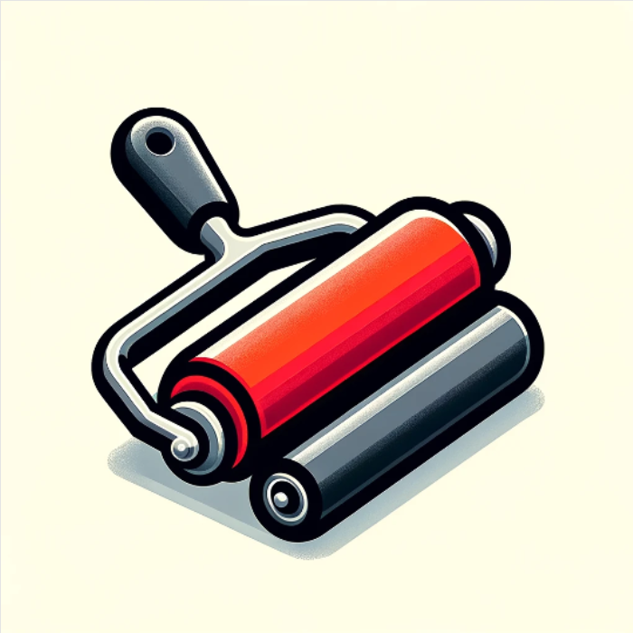

Use a good FSR sensor and make sure there are no cold solder joints or breaks.

It is possible to save the application as a PWA on Android devices and to use it offline.

There is no support for the application. Every request will be ignored.

https://gkab1992.github.io/Nipppa/
